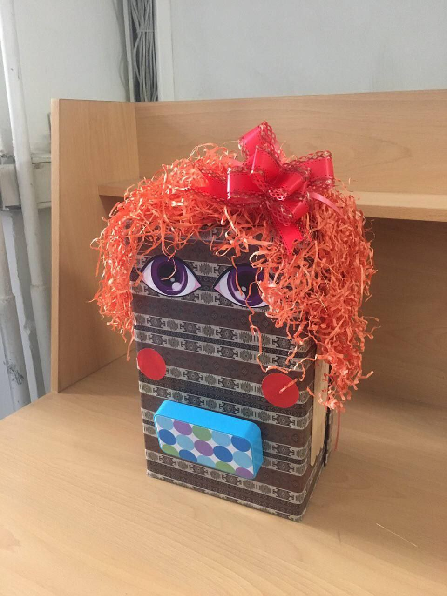

# Sindokht's Storytelling Generator

Sindokht is Rostam's grandma, and she tells us captivating stories. This project automatically generates Persian stories using AI and N-grams and reads them for you.

## Authors

- Benyamin Delshad Mamaghani
- Mohammad Mahzoun

## Contents

- **Docs:** Contains some sample stories for input.
- **Codes:** Contains Python files for this project.
- **prob.txt:** Contains frequencies (format: word #prob).
- **Report.pdf:** Contains reports of phase 1 of the project.
- **Images:** Contains images related to the project.

## Robot Photo

## How to Run

Just run `StoryGenerator.py` and listen to the story. Enjoy the mystical tales brought to life by Sindokht's storytelling generator!

---

*Note: Please make sure to have the necessary Python environment set up to run the program.*
